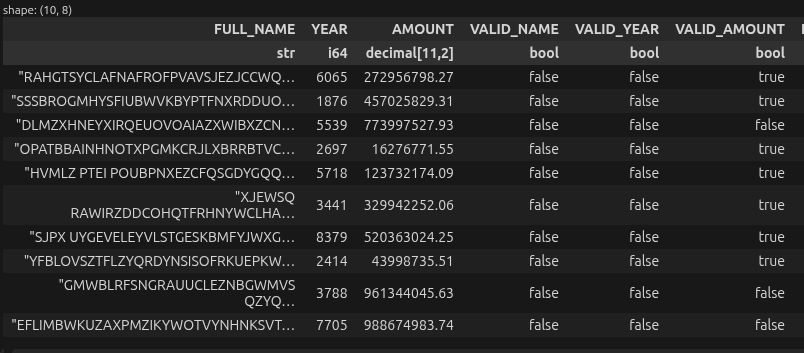

# mainframe-validator

High-performing Python-based tool for parsing fixed-width mainframe files. This is a common pattern in Regtech projects (Regulatory Technologies) applied in the central banking industry.

Additionaly, the input file is validated based on a set of declartive validation formulas.

## 1. Goal

According to many [technical assessments](https://niklas-heer.github.io/speed-comparison/), Rust is well-known as one of the fastest programming languages in execution time. Python is also known as one of the slowest.

The main goal of this repo is to benchmark two different implementations:
* a [Python](packages/file_parser/src/file_parser/parsers/polars/parser.py) parser (based on [polars](https://github.com/pola-rs/polars) analytical library)
* a [Rust](packages/file_parser/rust/src/lib.rs) parser developed from the scratch

## 2. Project structure and setup

The project is structured following a monorepo setup. Several python packages can be found in the [packages](packages/) folder.

```
mainframe_validator/
├── bin/
├── data/                            # Data files (gitignored)
├── docs/
├── notebooks/
├── packages/
│   ├── file_parser/                 # ← Fixed-length file parser from a cobol copybook
│   │   ├── rust/                    
│   │   │   └── src/lib.rs           # Rust extension code
│   │   ├── src/file_parser/
│   │   │   ├── main.py
│   │   │   ├── parsers/
│   │   │   │   ├── polars/          # Polars-based parser
│   │   │   │   │   ├── parser.py
│   │   │   │   │   └── utils.py
│   │   │   │   └── rust/            # Python bindings to Rust extension
│   │   │   ├── types/
│   │   │   └── utils/               
│   │   ├── tests/
│   │   └── typings/mainframe_tools/
│   └── formula_engine/              # ← Formula language for validations (and derived data)
│       ├── src/formula_engine/
│       │   ├── engine.py
│       │   ├── grammar/
│       │   └── graph/
│       └── tests/
├── conftest.py
├── formulas.txt                     # ← Formulas executed by benchmark.py
├── pyproject.toml                   # Workspace root (uv)
├── benchmark.py                     # ← Benchmark entrypoint
└── uv.lock
```

The project is managed using **uv**. To create the python virtual environment and download the dependencies of all the packages, run:

```console
uv sync --all-packages
```

Moder IDEs will automaticaly activate the virtual environment. Otherwise just activate it manually:

```console
source .venv/bin/activate
```

Additionally, using **Jupyter notebooks** is highly recommended to quick experimentation with the code. In the [notebooks](notebooks/) folder some working examples are available.

## 3. CI pipelines

To implement the CI pipelines, mainstream open-source development tools are used from [astral.sh](https://astral.sh) offering:
  - **uv:** project management + dependency management
  - **ruff**: linter and code formatter
  - **ty**: fast type checker

Unit and integration testing is based on **pytest**.

Assuming virtual environment is activated, these are suv ome commands typically used in CI pipelines:

```console
# Linting and formatting
ruff check .
ruff format .

# Type checking
ty check .

# Unit testing
pytest
```

## 4. Functional scope

Starting from a [COBOL copybook](https://www.ibm.com/docs/en/cics-ts/5.5.0?topic=books-cobol-copy), both parser implementations will execute the same data transformations:
  * **Parse the fixed-length file** accoding to the **copybook** and convert it into a tabular analytical file (Parquet) and store it on disk
  * Apply to the parquet file a set of **validation formulas** defined using a [formula language](formulas.txt), generating a new column for each validation formula

The sample copybook used is the following:

```cobol
       01  FILE-RECORD.
           05  FULL-NAME                  PIC X(50).
           05  YEAR                       PIC 9(4).
           05  AMOUNT                     PIC 9(09)V99.
```

The resulting dataframe is composed of 2 main blocks:
  - One column per field defined in the copybook (FULL_NAME, YEAR and AMOUNT)
  - One column per validation formula defined in the [formulas.txt](formulas.txt) file (VALID_NAME, VALID_YEAR, VALID_AMOUNT)

A sample list of declarative validation formulas is the following:

```SQL
VALID_NAME: LEN({FULL_NAME}) == 9
VALID_YEAR: BETWEEN({YEAR}, 1900, 2026)
VALID_AMOUNT: BETWEEN({AMOUNT}, 0, 672581176.44)
```

A visual representation of the expected results is depicted in the following screenshot:



Both versions rely on open-source high-performing analytical libraries, enabling state-of-the-art data processing techniques like:
  * Apache Arrow
  * SIMD vectorized CPU instructions

## 5. Performance analysis

### Generating a testing data file

The script `bin/generate_huge_ascii_file.py` writes a line-oriented fixed-width ASCII file from an input **COBOL copybook**.

During file generation, random values are chosen for 3 supported data types (`string`, `integer`, `decimal`). Significant free disk space (default output is at least **2 GiB**) will be required (/data folder is ignored by git).

In order to create a sample file, execute the following:

```console
uv run bin/generate_huge_ascii_file.py \
  test/fixtures/sample_file_record.cpy \
  data/huge_fixed_size_file.dat
```

The sample file will contain around **32,540,000** records.


### Running the performance tests

From project root:

```console
uv run benchmark.py
```
The `benchmark.py` script tracks the execution time of the following stages:

1. **Stage 1** — [`parse()`](packages/file_parser/src/file_parser/main.py) converts the fixed-width file to an analytics-friendly Apache Parquet on disk
2. **Stage 2** — [`formulas_etl`](benchmark.py) applies `formulas.txt` (validations and derived columns) and stores the results on disk.

The typical execution times of each implementation are the following:

| Backend | Time (same workload, same machine) | CPU during conversion |
| --- | ---: | --- |
| **Pure Rust** (`file_parser.parsers.rust`) | **~10 s** (typical) | High utilization across cores |
| **Python using Polars** (`file_parser.parsers.polars`) | **~10 s** (typical) | High utilization across cores |

## 6. Conclusions

According to experimental results and benchmarks, the **execution wall times of both implementations are similar**.

Both implementations are able to **use 100% of the available computation resources (CPU cores)** in the testing machine used [1]. Thermal throttling may be an issue (lowering CPU frequencies specially using mainstream low-end laptop processors with limited cooling) while CPU-core temperatures are too high.

Memory consumption is stable during execution, **being able to process files larger than memory**.

Additionally, **the Python-based implementation is way simpler and more maintainable**.

**Avoid running any pure Python function as an UDFs in the polars API if performance is an goal** (expect 20-50x penalty in execution time). For coding your data transformations, use only polars expressions that are backed by rust binary execution enviroment. 

## 6. References and media

[1] htop screenshot showing CPU utilization during tests


